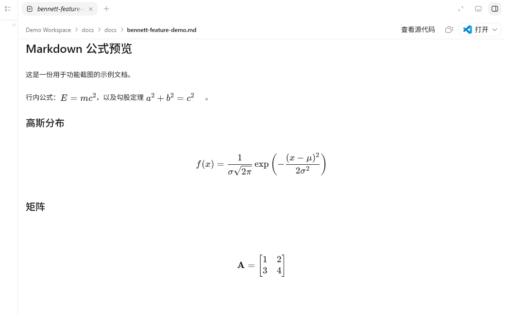

<div align="center">

# Bennett UI Improvements for Codex++

**A focused UI and workflow upgrade for BigPizzaV3 Codex++.**

[](https://github.com/JHees/bennett-ui-improvements-for-codexplusplus)
[](LICENSE)
[](https://github.com/BigPizzaV3/CodexPlusPlus)
[](#compatibility)

**English** · [简体中文](README.zh-CN.md)

</div>

Bennett UI Improvements is a renderer-only user script for [BigPizzaV3 Codex++](https://github.com/BigPizzaV3/CodexPlusPlus). It brings project-aware sidebar styling, reliable quota display, an enhanced Markdown preview, a native-history query-limit control, and a dedicated settings panel into one installable script.

This project adapts [b-nnett/codex-plusplus-bennett-ui](https://github.com/b-nnett/codex-plusplus-bennett-ui) to the BigPizzaV3 user-script runtime while preserving the original authorship and MIT license notices. The migration is maintained by [JHees](https://github.com/JHees).

## Highlights

| Area | What it adds |
| --- | --- |
| Sidebar | Project colors and backgrounds, compact action grid, optional square corners, and slash-menu polish. |
| Usage | Real 5-hour and weekly quota data, optional Credit view, reset-time tooltips, and explicit `API` mode. |
| History | Raise Codex's native recent-history query limit from 50 to a configurable 1–2000 without taking over conversation management. |
| Markdown | KaTeX formulas, math tables, images, relative image paths, and source inspection in `.md` previews. |
| Settings | A dedicated Bennett UI panel with per-feature switches and a native-history load control. |
| Noise reduction | Hides Codex quota-exhaustion and Plus/Pro upgrade prompts while keeping the composer and app-update notices visible. |

## Install

### Codex++ Script Market

1. Open **Codex++ Management Tools**.
2. Find and install **Bennett UI Improvements**.
3. Enable the script and select **Reload user scripts**.

The native history loader has been bundled into Bennett UI since 1.2.1. You do **not** need to install Codex List Pagebuster separately.

### Manual installation

Copy [`scripts/bennett-ui-improvements.js`](scripts/bennett-ui-improvements.js) to:

```text
%APPDATA%\Codex++\user_scripts\
```

Enable the script in Codex++ and reload user scripts. A full Codex restart is normally unnecessary.

## Features

| Feature | Default | Support |
| --- | ---: | --- |
| Project backgrounds and colors | On | Stable |
| 5-hour / Weekly / Credit usage | On | Stable when the current page exposes usage data |
| Hide quota-exhaustion prompts | On | Stable |
| Hide Plus/Pro upgrade prompts | On | Stable; Codex app-update notices remain visible |
| Enhanced Markdown preview | On | Stable for `.md` and `.markdown` previews |
| Settings search | On | Stable |
| Match settings-sidebar width | On | Stable |
| Compact sidebar action grid | On | Stable |
| Slash-menu polish | On | Stable |
| Native history query limit | Automatic | Requested once at startup; configurable from 1 to 2000 with manual retry |
| Square sidebar corners | Off | Stable |

Feature switches and the history loader are available under **Codex++ Management Tools → Bennett UI Settings**. Preferences are stored locally and survive script reloads.

## Native history query limit

Bennett UI lets Codex show more of its own recent conversations without replacing Codex's conversation management.

- Choose a limit from **1–2000**; the default is **500** instead of Codex's usual 50.
- The list refreshes automatically when Codex opens.
- Use **Reload history** in Bennett UI Settings whenever you want to refresh it manually.
- Codex and CC Switch continue to manage unified history, project grouping, ordering, and **Show more** behavior.

If a standalone Pagebuster installation is still enabled, both scripts use the same global entry point and hand off to a single active instance. Once Bennett UI is working, the standalone Pagebuster script can be removed.

When CC Switch unified session history is enabled, CC Switch/Codex still own the merge. Bennett neither reads session files nor creates a second conversation database.

## Usage-data behavior

- Saved quota snapshots are not presented as fresh data after startup.
- The widget updates only after receiving current renderer or `/wham/usage` data.
- Five-hour and weekly views show remaining percentage and reset-time tooltips.
- Credit appears only when actual credit data is available.
- API or pure-API providers show `API`; Bennett does not fabricate ChatGPT quota values.
- The standalone `market-hide-usage-alert.js` script is no longer needed because that behavior is built in.

## Quota-prompt filtering

- Hides Codex quota-exhaustion notices and upgrade prompts while keeping conversation content, the composer, and app-update notices visible.
- Works in both the main Codex interface and embedded ChatGPT views.
- Enable or disable it from **Codex++ Management Tools → Bennett UI Settings**.

## Markdown preview

The right-side Markdown preview supports:

- Inline and display math: `$...$`, `$$...$$`, `\(...\)`, and `\[...\]`.
- Codex's bundled KaTeX renderer—no external math CDN is required.
- Markdown tables, including math content inside cells.
- Local and relative image paths resolved from the current document.
- Selecting rendered math to inspect its LaTeX source.



## Compatibility

Bennett UI runs as a Codex++ user script and does not modify the official Codex installation. Features that depend on Codex's interface may need updates after major Codex releases. If something looks wrong, reload the user scripts first.

## Optional companion script

[`scripts/hidden-user-message-visibility-fix.js`](scripts/hidden-user-message-visibility-fix.js) is an independent compatibility fix for user messages hidden by conversation compaction or steering-rendering issues. It is not part of the Bennett UI core script.

## Credits and license

- Original project: [b-nnett/codex-plusplus-bennett-ui](https://github.com/b-nnett/codex-plusplus-bennett-ui)
- Target runtime: [BigPizzaV3/CodexPlusPlus](https://github.com/BigPizzaV3/CodexPlusPlus)
- Script Market: [BigPizzaV3/CodexPlusPlusScriptMarket](https://github.com/BigPizzaV3/CodexPlusPlusScriptMarket)
- Migration repository: [JHees/bennett-ui-improvements-for-codexplusplus](https://github.com/JHees/bennett-ui-improvements-for-codexplusplus)

Released under the [MIT License](LICENSE). Original copyright, attribution, and permission notices are preserved in the distributed script and [`NOTICE.md`](NOTICE.md).
